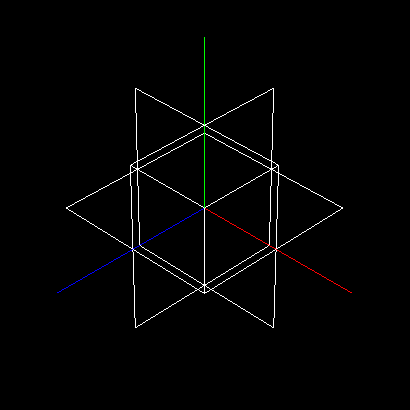

# Engine

How to use:
`./engine [path/to/config.xml]`

- Example:
  - `./engine ../scenes/output_scene_1/Cool_Models.xml`
  - View Mode `GL_LINE`
  - Models `[plane_1_1_x.3d,plane_1_1_y.3d,plane_1_1_z.3d]`

## Drawings

### Implemented

- View Mode `key: m`
- Quit `key: q`
- Angle Camera `key: Up, Down, Left, Right`
- Move Camera `key: mouse`
- Zoom Camera `key: - , +`
- Parse Camera starting point from scene XML
- 
